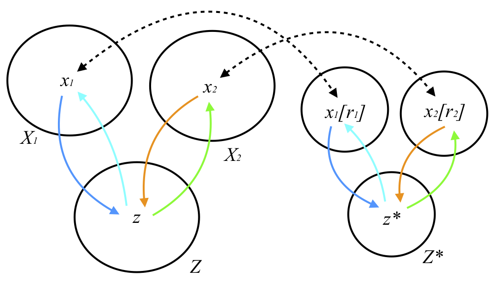

# ROI Constraint UNIT
[Unsupervised Image-to-Image Translation Networks (UNIT)](https://github.com/mingyuliutw/UNIT) proposed by NVIDIA presented a general framework for unsupervised image-to-image translation. This network can learn to translate an image from one domain to another without any image pairs information between the two domains. In this report, I basically add region of interest (ROI) constraint to UNIT to enhance the ability of transferring images between summer and winter on a specific dataset "Cab Ride Norway : Trondheim - Bodø Nordland Line"([summer](https://www.youtube.com/watch?v=TY1sbKvjNcY&t=1057s), [winter](https://www.youtube.com/watch?v=9pVWfzsgLoQ&t=8081s)). The experiment results show an improvement both on the training speed and the image translation quality between summer and winter railway trip.

Winter to summer:
* ROI Constraint UNIT (top)
* UNIT (down)

Summer to winter:
* ROI Constraint UNIT (top)
* UNIT (down)

## Baseline Method
* UNIT: UNsupervised Image-to-image Translation Networks
* GitHub repo: https://github.com/mingyuliutw/UNIT
* Paper link: https://arxiv.org/abs/1703.00848

## ROI Constraint
We propose a new assumption called ROI-specific shared-latent: The cycle consistency for the region of interest in two image domains has been enforced and the specific region of two images will be mapped to a same latent space.

## Organization of Codes
- The original UNIT
    - `datasets`
        Directory for different kinds of image loaders, defined in the original UNIT
    - `tools`
        Directory for training configuration loading, defined in the original UNIT
    - `trainers`
        Directory for the implementation of different netwokrs, generators, discriminators and encoders
    - `cocogan_train_domain_adaptation.py`
        Training scirpt for implementing domain adaptation
    - `cocogan_translate_one_image.py`
        Inference script for translating one image to the other domain
    - `cocogan_translate.py`
        Inference script for translating all images from image loader to the other domain
    - `common.py`
        A helper script for training utilization 
- My improvement
    - `cocogan_train_roi.py`
        Training script of ROI (Region of Interest) Constraint UNIT. I basically add a ROI generator and discriminator to enforce cycle consistency to the cropped image domains.
    - `trainers/cocgan_trainer.py`
        A script for implementing the weight update operation of generators and discriminators. I modified the weight update function to adapt to our needs.
    - `run_same_image_for_iterations.py`
        A script to generate image translation results for multiple generators
    - `run_same_net_for_images.py`
        A script to generate multiple image translation results using a specific generator
        
## Results
### Training Speed
Figure shows the training speed comparison of my improvement and the original UNIT. From left to right, I sampled generated images from winter to summer when `iteration=5000`, `iteration=20000`, `iteration=35000` and `iteration=85000` using both the ROI Constraint UNIT and the original UNIT. It is notable that the ROI Constraint UNIT shows a better image translation quality than the original UNIT as the iteration number of training increases. When iteration count has increase to 85000, the original UNIT still generates the summer images with blurriness while my method gives a clear and sharpen generated image quality.

### Translation Quality
Figure shows the image translation quality comparison of my improvement and the original UNIT. From left to right, there are winter to summer translation generated by ROI Constraint UNIT, winter to summer translation generated by the original UNIT, summer to winter translation generated by my improved method, and summer to winter translation generated by the original UNIT. It is noted that the ROI Constraint UNIT and the original UNIT are all trained for 85000 iterations.

